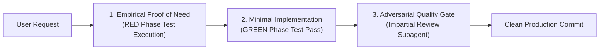
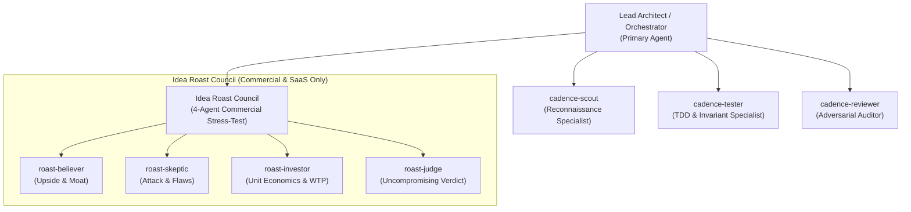
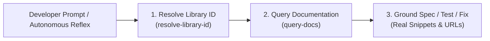

# Cadence ⚡

**High-Velocity Spec & TDD Execution Engine for Modern AI Coding Agents**

> *"The Red $\to$ Green discipline you love from Conductor, without the file bureaucracy that slows you down."*

[](https://antigravity.google)
[](#-autonomous-operational-reflexes-zero-command-automation)
[](#-the-red-green-refactor-invariant)
[](#-specialized-subagent-fleet)
[](#-live-documentation-grounding-context-7-mcp-integration)
[](LICENSE)

Cadence is a streamlined, agentic development plugin engineered natively for modern AI developer environments (Antigravity 2.0 and Claude Code). It takes the single most effective software engineering principle popularized by Conductor—**strict Test-Driven Development (Red-Green-Refactor)**—and upgrades it with **high-leverage subagent orchestration**, **autonomous operational reflexes**, and **native UI artifacts**, while completely eliminating repository clutter, fragile disk-based state machines, and high context taxes.

Instead of drowning your Git repository in ephemeral markdown files (`conductor/tracks/...`), Cadence manages execution state in Antigravity's native artifact space, enforces empirical test verification to stop model hallucinations, and coordinates specialized subagents to deliver rock-solid, production-grade code at maximum velocity.

---

## ⚡ Conductor vs. Cadence: The Architectural Evolution

| Architectural Vector | Conductor (Legacy) | Cadence (Antigravity 2.0 Native) |
|---|---|---|
| **Core TDD Contract** | Red $\to$ Green $\to$ Polish | **Red $\to$ Green $\to$ Refactor** *(Empirically enforced via test execution)* |
| **Plan & Spec Storage** | Heavy markdown files in Git (`conductor/tracks/...`) | **Native UI Artifacts** (`brain/`) — Zero Git repository pollution |
| **State Tracking** | Checkbox parsing on disk, `metadata.json` | **Live Reactive Artifacts** & Session State |
| **Prompt Overhead** | ~15–25 KB per turn (8.5 KB `workflow.md`) | **< 2 KB lean rules**, progressive on-demand skill loading |
| **Subagent Leverage** | Single-threaded linear turns | **Concurrent Specialized Subagents** (Scout, Tester, Reviewer, Roast Council) |
| **Execution Workspaces** | Dirtying working tree during exploratory trials | **Isolated Workspaces** (`Workspace: "branch"` / `"share"`) |
| **Interaction Layer** | Rigid terminal prompt loops | **Adaptive UX Layer** (Interactive GUI Modals + Terminal Fallback) |
| **Operational Triggering** | Repetitive manual slash command typing | **Autonomous Operational Reflexes** (Zero-command automation) |
| **Anti-Hallucination** | Passive document compliance | **Physical Test Probes & Adversarial Review Gates** |
| **Library Grounding** | Web searches or hallucinated APIs | **Context-7 MCP Grounding** (Live authoritative library docs & code snippets) |

---

## 🛠️ Installation Guide

Cadence is packaged as a standard agent plugin. Choose the installation method for your environment below.

### 1. Antigravity

#### A. End-User Installation (Recommended)
Install directly from GitHub via the Antigravity CLI:

```bash
agy plugins install https://github.com/Sayanthegamer/cadence
```

#### B. Developer Installation (Live-Sync Global Link)
If you want to contribute, modify rules, or develop custom skills, clone the repository locally and create a live-sync link:

1. Clone the repository:
   ```bash
   git clone https://github.com/Sayanthegamer/cadence.git
   cd cadence
   ```

2. Link globally for Antigravity:
   ```bash
   # Linux / macOS
   mkdir -p ~/.gemini/config/plugins/ && ln -sfn "$(pwd)" ~/.gemini/config/plugins/cadence

   # Windows (PowerShell - run as Administrator or in Developer Mode)
   New-Item -ItemType SymbolicLink -Path "$HOME\.gemini\config\plugins\cadence" -Target (Get-Location).Path
   ```

*Why this method?* The symlink establishes a live link. Any edits made to skills, agents, or rules are loaded immediately without reinstalling or restarting.

#### C. Workspace-Level Isolation
To isolate Cadence strictly inside a single repository:

```bash
mkdir -p .agents/plugins/
# Link Cadence into your target project:
ln -sfn /path/to/cadence .agents/plugins/cadence
```

---

### 2. Claude Code

Register the marketplace repository and install Cadence directly in your active Claude Code session:

```bash
/plugin marketplace add Sayanthegamer/cadence
/plugin install cadence
```

---

### 🔄 Uninstallation

To safely remove Cadence:

* **Antigravity:**
  * CLI Installation: `agy plugins uninstall cadence`
  * Global Link: Remove directory or symlink `~/.gemini/config/plugins/cadence`
  * Workspace Link: Remove `.agents/plugins/cadence`
* **Claude Code:**
  * Run `/plugin remove cadence` and `/plugin marketplace remove Sayanthegamer/cadence`

---

## 🛡️ The Anti-Hallucination Gauntlet

The greatest failure mode of modern LLM coding agents is **premature victory declaration**: claiming a bug is fixed or a feature is built without empirical proof, or hallucinating passing tests.

Cadence solves this through an unyielding three-layer defense:



1. **Empirical Proof of Need (Red Phase):** Before writing production code, the agent or `cadence-tester` must author an assertion probe or reproduction test and **physically run it**. If the test passes before code is touched, the test is invalid. An unverified failure is an unproven test.
2. **Deterministic Green Verification:** The agent implements code and executes the test harness again, verifying clean exit codes (`0`) and expected return values.
3. **Adversarial Quality Gate (`cadence-reviewer`):** Diff audits and invariant checks are delegated to an independent reviewer subagent without confirmation bias, guaranteeing code cleanliness, edge-case coverage, and pre-commit hygiene before staging.

---

## ⚡ Autonomous Operational Reflexes (Zero-Command Automation)

Developers should never be burdened with typing repetitive slash commands (e.g. `/cad-decide`, `/cad-flow`, `/cad-debug`) for standard workflows. Cadence bakes these engineering behaviors directly into the agent's core operational directives:

* **Autonomous ADR Logging:** Whenever an architectural crossroad, library selection, or database/pattern decision is agreed upon in conversation, Cadence **automatically writes and saves an Architectural Decision Record in `.agents/decisions/`** and informs you in a single line.
* **Autonomous TDD Reflex:** Any prompt to implement a feature or patch a defect immediately triggers the strict Red-Green-Refactor invariant without needing `/cad-flow`.
* **Autonomous Scientific Debugging:** When encountering test failures, runtime crashes, or subtle defects, Cadence automatically launches the 5-step scientific autopsy (repro script $\to$ hypotheses $\to$ assertion probes $\to$ root cause $\to$ cure). Never panic-edit production code.
* **Autonomous Stack Fingerprinting:** On Turn 1 in any project, Cadence silently inspects manifests (`pyproject.toml`, `package.json`, `Cargo.toml`, `go.mod`) to detect test runners, linters, and runtime versions. It will never ask you how to run tests.
* **Autonomous Pre-Commit Hygiene:** Before declaring any task complete, Cadence automatically sweeps diffs for `print()`, `console.log()`, `debugger;`, or temporary scratch files, runs project formatters (`ruff format`, `prettier`), and verifies regression suites.
* **Autonomous Session Standup:** When starting a fresh session or asking *"what's next?"* or *"where did we leave off?"*, Cadence inspects `git status`, recent commits, and active plan artifacts to deliver a crisp 3-bullet standup briefing.
* **Autonomous Context-7 Grounding Reflex:** Whenever working with third-party libraries, frameworks, SDKs, or APIs (e.g. PyTorch, Next.js, FastAPI, Prisma, Tailwind, etc.) during planning, debugging, or TDD—especially when encountering unfamiliar APIs, version discrepancies, deprecations, or library-specific errors—Cadence **autonomously queries Context-7 MCP (`resolve-library-id` $\to$ `query-docs`)** instead of relying on stale training memory. When you explore new packages or express uncertainty, Cadence proactively prompts you with authoritative docs and code snippets.

---

## 🤖 Specialized Subagent Fleet

Cadence features 7 purpose-built subagents designed for maximum context efficiency and parallel throughput:



### 1. Development Subagents

| Subagent | Role & Scope | Model Tier | Tools |
|---|---|---|---|
| **`cadence-scout`** | Read-only reconnaissance, fast codebase surveys, dependency tracing, and manifest inspection. Dispatches concurrently to map multiple modules without bloating lead context. | `flash` | Read-only |
| **`cadence-tester`** | Crafts targeted test harnesses, reproduction scripts, and edge-case contracts. Executes tests to empirically prove failure (Red Phase) before implementation. | `inherit` / `flash` | Read & Write / Test Runner |
| **`cadence-reviewer`** | Impartial code and regression auditor. Scans git diffs, executes linters and static analysis, checks ADR compliance, and hunts regressions with zero confirmation bias. | `inherit` / `pro` | Read-only / Linters |

### 2. The Idea Roast Council (Commercial Ideas & Startups Only)

When you are planning a **commercial product, startup, paid tool, SaaS, or monetized feature**, Cadence convenes the 4-agent Idea Roast Council:

> [!IMPORTANT]
> The Roast Council is strictly reserved for commercial ideas where capital or time is on the line. It **bypasses fun experiments, open-source hobbies, or scientific research** to avoid discouraging creative exploration.

* **`roast-believer`:** Makes the strongest, most compelling bull case. Finds the hidden upside, viral hook, and unfair distribution advantage.
* **`roast-skeptic`:** Attacks every single weak point. Exposes fatal blind spots, high churn risks, and brutal execution traps.
* **`roast-investor`:** Evaluates unit economics, CAC/LTV feasibility, enterprise procurement hurdles, and willingness to pay (WTP).
* **`roast-judge`:** Synthesizes the arguments and delivers an uncompromising final ruling:
  * 🟢 **BUILD:** Rock-solid proposition, cleared for execution.
  * 🟡 🏗️ **FIX FIRST:** Fatal flaw identified; must resolve prerequisite before writing code.
  * 🔴 🚜 **KILL:** Fundamentally unviable; pivot or abandon immediately.

## 📚 Live Documentation Grounding (Optional Context-7 MCP)

Even the most capable AI models suffer from training data cutoffs, deprecated APIs, and hallucinated function kwargs when working with fast-moving open-source libraries (e.g. Next.js App Router, PyTorch 2.x, Tailwind v4, Pydantic v2, Prisma, LangChain).

Cadence provides first-class support for the **Context-7 MCP Server** to fetch live, authoritative documentation, exact API signatures, and verified real-world code snippets directly into your workflow.

> [!TIP]
> **Optional Superpower (Zero Lock-In):**  
> Cadence only invokes Context-7 **if you have chosen to install and enable the `context7` MCP server**. If Context-7 is not installed, Cadence never crashes or errors out—it gracefully falls back to standard web search and local type inspection.

### 🌟 Why You Should Install Context-7 MCP:
* **Zero Training Cutoff Hallucinations:** Always reads live official documentation rather than guessing from pre-training memory.
* **Exact API Signatures:** Prevents test cases from failing due to hallucinated kwargs or deprecated methods.
* **Benchmark Scores & Code Snippets:** Returns community-curated, authoritative snippets ranked by reputation score.

### 🛠️ How to Install Context-7 MCP (One-Line Setup):

```bash
# For Antigravity:
agy mcp add context7 https://mcp.context7.com/mcp

# For Claude Code:
claude mcp add context7 https://mcp.context7.com/mcp
```

### How Context-7 Powers the Workflow:



1. **In Planning (`/cad-plan`):** Validates library contracts and available methods before locking specs into UI artifacts.
2. **In TDD Contracts (`/cad-flow`):** Asserts actual supported parameters in Red-phase tests so tests don't fail for the wrong reason.
3. **In Scientific Debugging (`/cad-debug`):** Checks official docs for obscure runtime errors, breaking changes, or version incompatibilities.
4. **In Architecture Decisions (`/cad-decide`):** Inspects Context-7 benchmark scores and code snippet coverage to inform ADRs.
5. **Direct User Querying (`/cad-docs`):** Run `/cad-docs <library> <topic>` at any time to pull verified snippets and official source links without leaving your IDE.

> 💡 **Proactive Grounding Reflex:** Whenever you explore a new library or express uncertainty, Cadence will proactively prompt you:  
> *"If you want live, authoritative documentation or code examples for **[Library]**, we can query Context-7 MCP via `/cad-docs <library>` (or install it via `agy mcp add context7 https://mcp.context7.com/mcp` if you haven't yet)."*

---

## 📦 Comprehensive Skills Catalog

Cadence includes 14 built-in skills covering the entire engineering lifecycle:

| Skill | Category | Primary Purpose | Generated Artifacts |
|---|---|---|---|
| **`cadence-flow`** | Core TDD | Rapid Red $\to$ Green $\to$ Refactor execution cycle with pre-commit sanitization. | Clean Git Commits |
| **`cadence-plan`** | Architecture | Creates an interactive implementation plan as a native Antigravity UI Artifact. | UI Artifact (`brain/`) |
| **`cadence-orchestrate`** | Multi-Agent | Concurrent delegation across subagents with isolated workspaces and model tiering. | Execution Reports |
| **`cadence-docs`** | Grounding | Live documentation and verified code snippets via Context-7 MCP (`resolve-library-id` $\to$ `query-docs`). | Official Docs & Snippets |
| **`cadence-status`** | Project Health | Instant session standup, active task tracker, and working-tree overview. | Markdown Summary |
| **`cadence-review`** | Verification | Principal Engineer diff audit, test suite verification, and PR packaging. | Review Report |
| **`cadence-debug`** | Diagnostics | 5-step scientific root-cause autopsy (repro $\to$ hypotheses $\to$ probes $\to$ cure). | Diagnostic Log / Fix |
| **`cadence-bench`** | Performance | Micro-benchmarking execution latency, throughput, and memory/VRAM deltas. | Benchmark Comparison |
| **`cadence-clean`** | Janitor | Safe dead-code purge and tech-debt cleanup with automated rollback on failure. | Cleaned Source Code |
| **`cadence-tour`** | Onboarding | Interactive codebase architecture map and *"Read These 3 Files First"* onboarding tour. | Visual UI Artifact |
| **`cadence-decide`** | Architecture | Records "Why This, Not That" Architectural Decision Records. | `.agents/decisions/ADR-*.md` |
| **`cadence-roast`** | Strategy | Convenes the 4-agent Idea Roast Council to stress-test commercial products. | Roast Council Verdict |
| **`cadence-ideate`** | Exploration | Creative sparring partner for idea capture, ELI5 trade-offs, and visual architectures. | UI Ideation Artifact |
| **`cadence-revert`** | Safety | Safe atomic rollback of failed experiments or invalid tasks back to clean state. | Clean Working Tree |

---

## ⚡ Slash Commands Reference

Cadence registers 12 native slash commands directly into your chat autocomplete for immediate control:

```
/cad-status   - Instant standup & session overview ("Where did we leave off?")
/cad-docs     - Live library documentation & verified code examples via Context-7 MCP
/cad-debug    - Scientific root-cause autopsy (repro -> hypotheses -> probes -> cure)
/cad-flow     - High-velocity TDD cycle (Red -> Green -> Sanitize -> Commit)
/cad-review   - Principal Engineer diff audit, test verification, & PR packaging
/cad-bench    - Micro-benchmark latency, throughput, & memory before vs. after
/cad-clean    - Safe dead-code purge & tech-debt cleanup with auto-rollback
/cad-tour     - Interactive architecture map & "Read These 3 Files First" tour
/cad-decide   - Record "Why This, Not That" ADR in .agents/decisions/
/cad-roast    - Convene the 4-agent Idea Roast Council for startups/commercial ideas
/cad-plan     - Create interactive UI Plan Artifact with zero Git clutter
/cad-revert   - Safe emergency reset of failed experiments back to clean Git
```

---

## 🚦 Construction & Traffic Status System

Cadence rejects vague, misleading star ratings in favor of concrete engineering traffic-light and construction status indicators:

* 🟢 **Green / Cleared:** Invariants satisfied, tests passing, production-ready.
* 🟡 🏗️ **Amber / Under Construction:** In-flight, functional draft, or requires addressing prerequisites before merging.
* 🔴 🚜 **Red / Blocked:** Failing invariant, test failure, or unviable proposal.
* 📐 **Architecture:** Planning, interface contracts, and spec modeling.
* 🔨 **Implementation:** Active coding and TDD iteration.
* 🧰 **Maintenance:** Refactoring, linting, dead-code removal, and janitorial cleanup.
* 🚧 **Staging:** Awaiting user signoff or pre-commit review.

---

## 🎨 Adaptive User Experience (UX Layer)

Cadence natively adapts its user interface to your host environment with zero configuration:

* **Interactive GUI Modals:** In modern IDEs supporting graphical controls (e.g. Antigravity IDE), Cadence uses interactive modals (`ask_question`) for design decisions, plan confirmations, and track options.
* **Native UI Artifacts:** Plans, architecture tours, and benchmarks are rendered in Antigravity's persistent artifact space (`brain/<conversation-id>`) with clickable file links, live Mermaid diagrams, and expandable slides.
* **Graceful CLI Fallback:** In pure terminal consoles (Claude Code, SSH sessions), Cadence automatically adapts prompts into numbered bracketed choice menus (e.g. `[1] Option A, [2] Option B`) and clean stdout tables.

---

## 📖 End-to-End Workflow Lifecycles

### 1. Building a Feature (Greenfield or Brownfield)

```bash
# Step 1: Design and plan without Git pollution
/cad-plan "Add streaming response caching with Redis"

# Step 2: High-velocity TDD execution (or let Autonomous Reflexes take over)
/cad-flow "Implement cache invalidation logic"

# Step 3: Impartial audit before staging
/cad-review
```

### 2. Scientific Defect Autopsy (No Panic-Editing)

When a test crashes or unexpected behavior appears:

```bash
/cad-debug "Fix sporadic tensor mismatch in batch normalization"
```
Cadence executes the 5-step scientific autopsy:
1. **Reproduction Script:** Isolates the failure in `< 30` lines.
2. **Competing Hypotheses:** Formulates $\ge 2$ falsifiable hypotheses.
3. **Diagnostic Probes:** Instruments targeted assertions to eliminate incorrect hypotheses.
4. **Root Cause Identification:** Pinpoints the exact line and underlying defect.
5. **Surgical Cure & Regression Test:** Implements the fix and adds a permanent regression test.

### 3. Stress-Testing a Commercial Idea

```bash
/cad-roast "A SaaS that monitors LLM API spend and automatically switches models"
```
The Idea Roast Council evaluates the proposition:
* `roast-believer` identifies the enterprise cost-control hook.
* `roast-skeptic` points out latency penalties and context window incompatibilities.
* `roast-investor` analyzes margin compression and B2B sales cycles.
* `roast-judge` issues the verdict: `🟡 🏗️ FIX FIRST: Resolve latency SLA overhead before building UI`.

---

## 🔄 Conductor to Cadence Migration Matrix

Migrating from Conductor to Cadence requires zero breaking changes to your code. Simply drop Cadence into your plugins directory:

| Conductor Command | Cadence Command | What Changes? |
|---|---|---|
| `/conductor:conductor-setup` | *(Autonomous)* | Cadence auto-fingerprints stack, linters, and test runners on Turn 1. No setup files needed. |
| `/conductor:conductor-new-track` | `/cad-plan` | Specs live in native UI Artifacts instead of creating git-tracked `conductor/tracks/...` directories. |
| `/conductor:conductor-implement` | `/cad-flow` or `/cad-orchestrate` | Strict Red-Green-Refactor enforced via test runner; concurrent subagent execution. |
| `/conductor:conductor-status` | `/cad-status` | Instant session overview generated directly from Git state and UI artifacts. |
| `/conductor:conductor-review` | `/cad-review` | Principal Engineer diff audit and PR packaging with zero metadata clutter. |
| `/conductor:conductor-revert` | `/cad-revert` | Rollback to clean Git checkpoint with root-cause autopsy. |

---

## 📂 Repository Structure

```
cadence/
├── README.md                      # Complete Developer & Architecture Manual
├── plugin.json                    # Plugin metadata and descriptor
├── rules/
│   └── AGENTS.md                  # Autonomous operational directives & TDD invariant
├── agents/                        # 7 Specialized Subagents
│   ├── cadence-scout/             # Fast read-only codebase explorer
│   ├── cadence-tester/            # Red-phase TDD & test specialist
│   ├── cadence-reviewer/          # Adversarial quality & regression gate
│   ├── roast-believer/            # Idea Roast Council: Bull case & upside
│   ├── roast-skeptic/             # Idea Roast Council: Bear case & flaws
│   ├── roast-investor/            # Idea Roast Council: Unit economics & WTP
│   └── roast-judge/               # Idea Roast Council: Uncompromising verdict
├── commands/                      # 12 Direct Slash Commands
│   ├── cad-status.md              # Standup & project status
│   ├── cad-docs.md                # Context-7 MCP live documentation
│   ├── cad-debug.md               # Scientific root-cause debugging
│   ├── cad-flow.md                # Red-Green-Refactor TDD loop
│   ├── cad-review.md              # Diff audit & PR packaging
│   ├── cad-bench.md               # Latency & throughput benchmarking
│   ├── cad-clean.md               # Tech-debt & dead-code janitor
│   ├── cad-tour.md                # Interactive architecture tour
│   ├── cad-decide.md              # "Why This, Not That" ADR engine
│   ├── cad-roast.md               # Commercial idea stress-test
│   ├── cad-plan.md                # Native UI implementation plan
│   └── cad-revert.md              # Safe state rollback
└── skills/                        # 14 Protocol Execution Engines
    ├── cadence-flow/              # TDD Red-Green-Refactor engine
    ├── cadence-plan/              # Native artifact spec engine
    ├── cadence-orchestrate/       # Multi-agent concurrent runner
    ├── cadence-docs/              # Context-7 MCP live grounding engine
    ├── cadence-status/            # Zero-disk status engine
    ├── cadence-review/            # Adversarial review protocol
    ├── cadence-debug/             # 5-step scientific autopsy
    ├── cadence-bench/             # Pre/post benchmark profiler
    ├── cadence-clean/             # Safe janitorial cleaner
    ├── cadence-tour/              # Codebase onboarding tour
    ├── cadence-decide/            # ADR generation engine
    ├── cadence-roast/             # 4-agent council coordinator
    ├── cadence-ideate/            # Creative idea sparring partner
    └── cadence-revert/            # Safe rollback engine
```

---

## 🎓 Design Principles

1. **Empirical Over Asserted:** Never believe code works because the model says so. Run the test, capture the exit code, and verify.
2. **Zero Repository Pollution:** Ephemeral plans, prompts, and temporary files belong in Antigravity UI Artifacts, not in your production Git tree.
3. **High-Velocity Subagents:** Offload research to fast, low-cost subagents (`flash`) and keep the primary agent focused on architecture and integration.
4. **Autonomous Reflexes:** Great tooling works silently. An engineer should never have to remind an AI agent to write tests or clean up after itself.

---

## ⚖ License

Cadence is open-source software licensed under the [Apache License 2.0](LICENSE).
