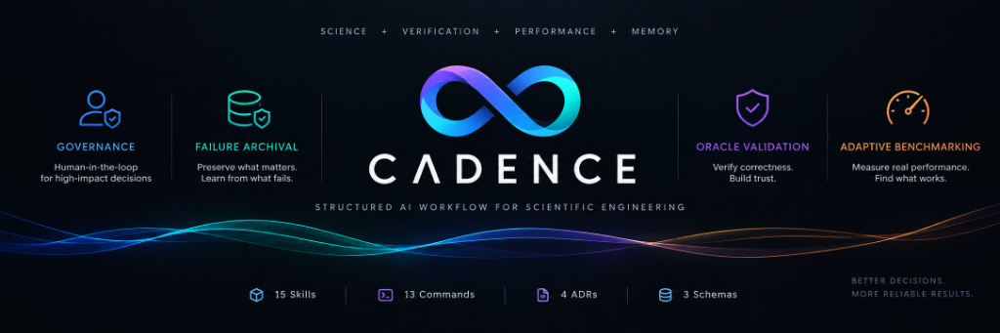
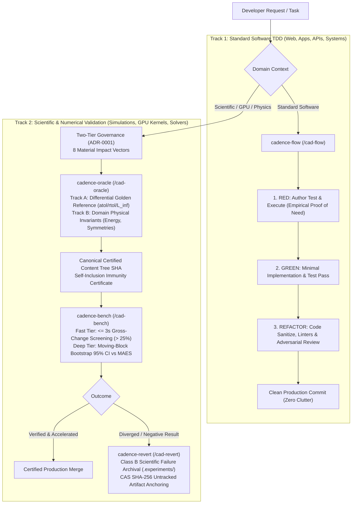
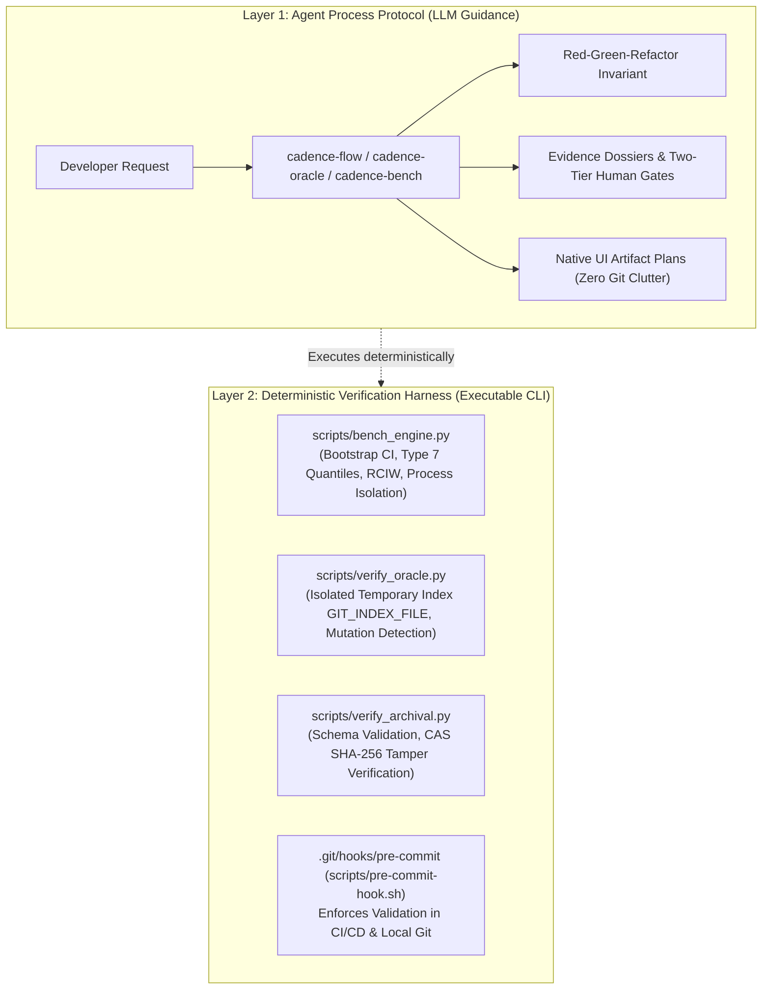
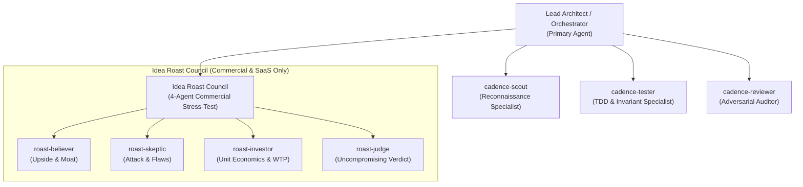
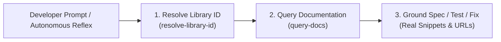
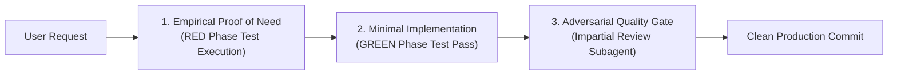

<p align="center">
  
</p>

# Cadence ⚡

**High-Velocity Spec, TDD & Empirical Validation Engine for Modern AI Coding Agents**

> *"The Red to Green to Refactor discipline you love from Conductor, evolved into a dual-engine architecture for high-velocity software engineering and rigorous scientific/numerical computing."*

[](https://antigravity.google)
[](https://docs.anthropic.com)
[](#-installation-guide)
[](LICENSE)

Cadence is a next-generation agentic development plugin engineered natively for modern AI developer environments (**Antigravity 2.0** and **Claude Code**). 

Cadence takes the single most proven software engineering discipline popularized by Conductor—**strict Test-Driven Development (Red-Green-Refactor)**—and upgrades it with **high-leverage subagent orchestration**, **autonomous operational reflexes**, and **native UI artifacts**, while completely eliminating repository clutter, fragile disk-based state machines, and high context taxes.

Furthermore, Cadence solves the fundamental limitation of traditional software engineering tools when applied to complex technical domains: **it extends TDD into scientific computing, physics simulations, GPU kernels, and numerical software**.

---

## 🎯 Dual-Track Engineering Architecture: Is Cadence Still TDD?

**Yes—in fact, Cadence enforces TDD more strictly than traditional tools.** However, Cadence recognizes that a simple boolean assertion (`assert x == y`) is insufficient for scientific, physical, and accelerated systems. 

Cadence operates across **two complementary, seamlessly integrated tracks**:



### 1. Track 1: Standard Software Engineering (Strict Red-Green-Refactor)
For web applications, REST/GraphQL APIs, CLI tools, and distributed services, Cadence executes strict, high-velocity **Red-Green-Refactor TDD**:
* **Empirical Proof of Need (Red Phase):** Before a single line of production code is written, a reproduction test or contract assertion is authored and **physically executed** to prove failure.
* **Deterministic Green Phase:** Write the leanest implementation to pass the test harness.
* **Refactor & Pre-Commit Hygiene:** Strip all debug statements, format with project tools (`ruff`, `prettier`), and run full regression suites.
* **Zero Git Clutter:** Task lists, specifications, and architecture plans are managed in **native Antigravity UI Artifacts** (`brain/`) rather than polluting your Git commit history with markdown checklists (`conductor/tracks/...`).

### 2. Track 2: Scientific, Numerical & GPU Compute (Generalized Empirical TDD)
In scientific computing, floating-point math, and GPU shader programming, classic boolean unit testing fails:
* **Floating-point results are never identical:** Testing an accelerated CUDA kernel against a CPU reference requires numerical tolerance budgets ($\text{atol}$, $\text{rtol}$, $L_\infty$) across PRNG seed matrices (**Track A Differential Oracle**).
* **Physics must obey conservation laws:** Continuous dynamical systems must conserve energy, preserve momentum, and remain free of NaNs/Infs across time steps (**Track B Physical Invariants**).
* **Performance cannot be tested with brittle timers:** Running `assert duration < 5ms` fails due to OS scheduling, CPU thermal throttling, and cache warmups. Rigorous performance assertions require moving-block bootstrap statistical confidence intervals evaluated against a Minimum Actionable Effect Size (**Deep Tier Benchmarking**).
* **Negative experiments are valuable knowledge:** If a newly formulated numerical scheme diverges, it is not a typo to be discarded with `git checkout`; it is a **Class B scientific failure** to be formally archived with machine-readable metadata and Content-Addressed Storage (**CAS SHA-256**) trace anchoring.

---

## ⚙️ Dual-Layer Architecture: Agent Protocols vs. Deterministic Verification Harness

A common limitation of AI coding frameworks is that rules remain purely aspirational markdown prompts—if the model hallucinates or rationalizes around a test failure, unverified code gets committed.

Cadence addresses this by enforcing an explicit separation of concerns:



1. **The Agent Process Protocol (Prompt & Subagent Layer):**
   Markdown instructions, prompt skills, and specialized subagents (`cadence-tester`, `cadence-reviewer`, `cadence-scout`) that structure the model's reasoning loop, enforce Red-Green-Refactor test authoring, compile neutral Evidence Dossiers, and eliminate confirmation bias.
2. **The Deterministic Verification Harness (Executable CLI Layer):**
   Platform-agnostic Python engines and Git index plumbing that run independently of any LLM:
   - **`scripts/bench_engine.py`**: Pure Python statistical profiler implementing Hyndman & Fan Type 7 quantiles, moving-block bootstrap (Politis & Romano), authorized RCIW stopping, and cross-platform process isolation (POSIX process groups / Windows tree termination).
   - **`scripts/verify_oracle.py`**: Standalone CLI using isolated Git temporary index plumbing (`GIT_INDEX_FILE`) to compute Canonical Tree SHAs, verify reference provenance, and detect post-certification mutations.
   - **`scripts/verify_archival.py`**: Standalone CLI verifying `.experiments/` JSON schemas and CAS SHA-256 hashes of untracked binary traces.
   - **`scripts/pre-commit-hook.sh`**: A standard Git pre-commit hook runnable by developers or CI/CD pipelines to block commits that violate certification or CAS integrity outside of the agent.

---

## ⚡ Conductor vs. Cadence: The Architectural Evolution

| Architectural Vector | Conductor (Legacy) | Cadence (Antigravity 2.0 Native) |
|---|---|---|
| **Core TDD Contract** | Red $\to$ Green $\to$ Polish | **Red $\to$ Green $\to$ Refactor** *(Empirically enforced via test execution)* |
| **Plan & Spec Storage** | Heavy markdown files in Git (`conductor/tracks/...`) | **Native UI Artifacts** (`brain/`) — Zero Git repository pollution |
| **State Tracking** | Checkbox parsing on disk, `metadata.json` | **Live Reactive Artifacts** & Session State |
| **Prompt Overhead** | ~15–25 KB per turn (8.5 KB `workflow.md`) | **< 2 KB lean rules**, progressive on-demand skill loading |
| **Subagent Leverage** | Single-threaded linear turns | **Concurrent Specialized Subagents** (Scout, Tester, Reviewer, Roast Council) |
| **Execution Workspaces** | Dirtying working tree during exploratory trials | **Isolated Workspaces** (`Workspace: "branch"` / `"share"`) |
| **Interaction Layer** | Rigid terminal prompt loops | **Adaptive UX Layer** (Interactive GUI Modals + Terminal Fallback) |
| **Operational Triggering** | Repetitive manual slash command typing | **Autonomous Operational Reflexes** (Zero-command automation) |
| **Anti-Hallucination** | Passive document compliance | **Physical Test Probes & Adversarial Review Gates** |
| **Scientific Computing** | None (pure web/app focus) | **Four Scientific Pillars** (Governance, Archival, Oracles, Statistical Benchmarking) |
| **Library Grounding** | Web searches or hallucinated APIs | **Context-7 MCP Grounding** (Live authoritative library docs & code snippets) |

---

## 🔬 The Four Scientific Computing Pillars

Cadence provides full architectural, verification, and empirical support for experimental compute, numerical physics, GPU kernels, and simulation software alongside high-velocity web/app development:

```mermaid
flowchart TD
    subgraph P1 ["Pillar 1: Two-Tier Architectural Governance"]
        G["ADR-0001: 8 Material Impact Vectors\n(Correctness, PRNG, tolerances, scaling,\nmemory layout, concurrency, interfaces, dependencies)"] --> Gate["Human Decision Gate (ask_question)\nNeutral Evidence Dossiers (Zero Bias)"]
    end

    subgraph P2 ["Pillar 2: Scientific Failure Archival"]
        R["cadence-revert (/cad-revert)"] --> Classify{"Class A Defect\nvs.\nClass B Scientific Failure?"}
        Classify -- "Class A (Typo/Bug)" --> Wipe["Clean Reset (Zero Clutter)"]
        Classify -- "Class B (Negative Result)" --> Archive[".experiments/ Metadata + CAS SHA-256\nSelective Branching (archive/exp-*)"]
    end

    subgraph P3 ["Pillar 3: Layered Oracle Validation"]
        O["cadence-oracle (/cad-oracle)"] --> TrackA["Track A: Differential Testing vs Golden Reference\n(atol, rtol, L_inf bounds across Seed Matrix)"]
        O --> TrackB["Track B: Domain Physical Invariants\n(Energy conservation, symmetries, non-NaN/Inf)"]
        TrackA & TrackB --> Tree["Canonical Certified Content Tree\n(Temporary index plumbing excluding certificates)"]
        Tree --> Cert[".experiments/certificates/<tree_sha>.json\nTolerance Relaxation = Tier 1 Gate"]
    end

    subgraph P4 ["Pillar 4: Adaptive Two-Tier Benchmarking"]
        B["cadence-bench (/cad-bench)"] --> Fast["Fast Tier (<= 3s wall-clock)\n> 25% Gross-Change Screening\nDecoupled Direction (REGRESSION/SPEEDUP)"]
        B --> Deep["Deep Tier (10s..45s Adaptive Envelope)\nMoving-Block Bootstrap 95% CI vs MAES\nAuthorized RCIW / Near-Zero MAES Formula"]
        Deep --> Precedence["5-Step Mutually Exclusive Precedence Ladder\n(Optimization, Equivalence, Regression, Inconclusive)"]
        Deep --> Watchdog["Process-Tree Watchdog Termination\nPOSIX killpg / Windows taskkill -> Capacity Isolation"]
    end
```



### Pillar 1: Two-Tier Architectural Governance ([ADR-0001](.agents/decisions/ADR-0001-two-tier-architectural-governance.md))
Architectural decisions, library choices, and algorithmic changes are governed by material impact across the **8 Material Impact Vectors**:
1. *Numerical Results or Physical Correctness* (floating-point schemes, integration stability, conservation laws).
2. *Reproducibility or Determinism* (seed control, PRNG state, reduction order, parallel synchronization).
3. *Precision or Error Tolerances* (`fp64`/`fp32`/`fp16`, epsilon budgets, `rtol`/`atol` adjustments).
4. *Performance Characteristics or Scaling Behavior* (complexity shifts, memory saturation, vectorization).
5. *Memory Layout or Data Movement* (AoS vs SoA, contiguous vs strided layout, host-to-device transfers).
6. *Concurrency, Synchronization, or Execution Model* (task vs data parallelism, atomics, lock-free queues).
7. *Public or Module Interfaces* (API contracts, schema changes, coordinate systems).
8. *Algorithmic, Mathematical, Rendering, or External Dependency Choices* (solvers, frameworks, rendering engines).

* **Tier 1 (Foundational / Consequential):** Triggers whenever any of the 8 vectors is materially affected. The agent investigates $\ge 2$ viable alternatives, compiles an unbiased **Evidence Dossier** with zero `(Recommended)` labels and zero default selections, and halts for explicit human authorization via `ask_question`.
* **Tier 2 (Tactical / Localized):** Localized, immediately reversible decisions with zero material impact proceed autonomously with an observable 1-line trace: `- [Tactical Decision] <description> (Reversible, zero impact on 8 vectors)`.
* **The Uncertainty Invariant:** If the agent cannot prove zero material impact with absolute confidence, it **must default to Tier 1** and pause for human review.

### Pillar 2: Scientific Failure Archival ([ADR-0002](.agents/decisions/ADR-0002-scientific-failure-archival.md))
Cadence avoids both Git branch sprawl and the catastrophic loss of negative experimental knowledge through a **2A + Selective 2B Hybrid Architecture**:
* **Class A (Ordinary Engineering Defects):** Typos, syntax bugs, or broken tests are rolled back cleanly, leaving zero repository clutter.
* **Class B (Scientific / Exploratory Failures):** Algorithms that failed due to physical divergence, numerical instability, or poor scaling are preserved in queryable `.experiments/` manifests compliant with [`schemas/experiment-v1.json`](schemas/experiment-v1.json).
* **Content-Addressed Storage (CAS):** Untracked large artifacts (logs, profiling dumps, checkpoints) are hashed via SHA-256 and anchored in the metadata record.
* **Selective Branching:** Git branches (`archive/exp-*`) are created only for high-value codebases worth preserving as full historical worktrees.

### Pillar 3: Layered Oracle Validation ([ADR-0003](.agents/decisions/ADR-0003-layered-oracle-validation.md))
Before any accelerated or modified kernel can be certified for production, it must pass dual-track validation:
* **Track A (Differential Testing):** Evaluates candidate output against an immutable Golden Reference across a deterministic PRNG seed matrix, enforcing pointwise and $L_\infty$ limits ($|y_{\text{cand}} - y_{\text{ref}}| \le \text{atol} + \text{rtol} \cdot |y_{\text{ref}}|$). Reference source code is cryptographically bound to prevent silent substitution.
* **Track B (Domain Invariant Verification):** Verifies physical conservation laws (energy drift, momentum conservation, symplectic geometry, Galilean/rotational symmetries) and guarantees NaN/Inf-free states.
* **Canonical Certified Content Tree:** The certificate is bound to the exact Git tree SHA computed via an isolated temporary index (`GIT_INDEX_FILE`), guaranteeing self-inclusion immunity (the certificate never invalidates its own recorded tree hash) and instant detection of post-certification code tampering.

### Pillar 4: Adaptive Two-Tier Benchmarking ([ADR-0004](.agents/decisions/ADR-0004-adaptive-two-tier-benchmarking.md))
* **Fast Tier (Development Feedback):** Wall-clock execution capped at $\le 3.0\text{s}$. Detects gross shifts ($> 25.000\%$ absolute change) with decoupled signed direction (`SPEEDUP`, `REGRESSION`, `NEUTRAL`). Fast Tier never declares false equivalence or premature victory.
* **Deep Tier (Production Certification):** Adaptive statistical profiling using moving-block bootstrap (Politis & Romano) with Hyndman & Fan Type 7 quantiles. Computes 95% confidence intervals against a declared Minimum Actionable Effect Size (MAES).
* **Authorized Precision Stopping (RCIW):** Normal stopping criteria: $\text{RCIW} = \text{CI}_{\text{width}} / |\Delta_{\text{median}}| \le \text{RCIW}_{\text{target}}$. When $|\Delta_{\text{median}}| \to 0$, Cadence autonomously transitions to the authorized scale-independent formulation: $\text{RCIW}_{\text{MAES}} = (\text{CI}_{\text{width}} / 2) / \text{MAES}$.
* **Enforced Timing Budgets:** Gated minimum observation window ($t \ge T_{\min} = 10.0\text{s}$) prevents premature early exit before thermal/scheduler noise can be observed; iteration-boundary ceiling ($T_{\max} = 45.0\text{s}$) prevents runaway profiling with bounded single-sample overshoot ($\le \Delta t_{\text{sample}}$).
* **Precedence Ladder:** Enforces a 5-step mutually exclusive evaluation ladder (`ACTIONABLE_OPTIMIZATION`, `PRACTICALLY_EQUIVALENT`, `ACTIONABLE_REGRESSION`, or `INCONCLUSIVE`).
* **Capacity Envelope & Watchdog Supervision:** Staged workload sweeps isolate memory and hardware boundaries. Worker processes run in isolated subprocess trees with cross-platform watchdog supervision (POSIX `os.killpg` process groups / Windows `taskkill.exe /F /T /PID`), accurately categorizing timeouts, OOMs, GPU TDR device resets, and native worker crashes.

---

## ⚡ Autonomous Operational Reflexes (Zero-Command Automation)

Developers should never be burdened with typing repetitive slash commands (`/cad-decide`, `/cad-flow`, `/cad-debug`) for standard workflows. Cadence bakes these engineering behaviors directly into the agent's core operational directives:

* **Two-Tier Governance Reflex (ADR-0001):** Whenever an architectural crossroad, mathematical formulation, tolerance shift, or external dependency choice is encountered, Cadence **halts autonomous execution, compiles an unbiased Evidence Dossier, and presents an interactive gate (`ask_question`)**. The agent never writes or assumes an `Accepted` ADR without explicit human signoff. For localized, reversible tactical decisions with zero material impact across all 8 vectors, Cadence logs an observable 1-line trace entry: `- [Tactical Decision] <description> (Reversible, zero impact on 8 vectors)`.
* **Autonomous TDD Reflex:** Any prompt to implement a feature or patch a defect immediately triggers the strict Red-Green-Refactor invariant without needing `/cad-flow`.
* **Autonomous Scientific Debugging:** When encountering test failures, runtime crashes, or subtle defects, Cadence automatically launches the 5-step scientific autopsy (repro script $\to$ hypotheses $\to$ assertion probes $\to$ root cause $\to$ cure). Never panic-edit production code.
* **Autonomous Stack Fingerprinting:** On Turn 1 in any project, Cadence silently inspects manifests (`pyproject.toml`, `package.json`, `Cargo.toml`, `go.mod`) to detect test runners, linters, and runtime versions. It will never ask you how to run tests.
* **Autonomous Pre-Commit Hygiene:** Before declaring any task complete, Cadence automatically sweeps diffs for `print()`, `console.log()`, `debugger;`, or temporary scratch files, runs project formatters (`ruff format`, `prettier`), and verifies regression suites.
* **Autonomous Session Standup:** When starting a fresh session or asking *"what's next?"* or *"where did we leave off?"*, Cadence inspects `git status`, recent commits, and active plan artifacts to deliver a crisp 3-bullet standup briefing.
* **Autonomous Context-7 Grounding Reflex:** Whenever working with third-party libraries, frameworks, SDKs, or APIs (e.g. PyTorch, Next.js, FastAPI, Prisma, Tailwind, etc.) during planning, debugging, or TDD—especially when encountering unfamiliar APIs, version discrepancies, deprecations, or library-specific errors—Cadence **autonomously queries Context-7 MCP (`resolve-library-id` $\to$ `query-docs`)** instead of relying on stale training memory. When you explore new packages or express uncertainty, Cadence proactively prompts you with authoritative docs and code snippets.

---

## 🤖 Specialized Subagent Fleet

Cadence features 7 purpose-built subagents designed for maximum context efficiency and parallel throughput:



### 1. Development Subagents

| Subagent | Role & Scope | Model Tier | Tools |
|---|---|---|---|
| **`cadence-scout`** | Read-only reconnaissance, fast codebase surveys, dependency tracing, manifest inspection, and past ADR reviews. Dispatches concurrently to map multiple modules without bloating lead context. | `flash` | Read-only |
| **`cadence-tester`** | Crafts targeted test harnesses, reproduction scripts, differential oracles, and edge-case contracts. Executes tests to empirically prove failure (Red Phase) before implementation. | `inherit` / `flash` | Read & Write / Test Runner |
| **`cadence-reviewer`** | Impartial code and regression auditor. Scans git diffs, executes linters and static analysis, checks ADR compliance, and hunts regressions with zero confirmation bias. | `inherit` / `pro` | Read-only / Linters |

### 2. The Idea Roast Council (Commercial Ideas & Startups Only)

When you are planning a **commercial product, startup, paid tool, SaaS, or monetized feature**, Cadence convenes the 4-agent Idea Roast Council:

> [!IMPORTANT]
> The Roast Council is strictly reserved for commercial ideas where capital or time is on the line. It **bypasses fun experiments, open-source hobbies, or scientific research** to avoid discouraging creative exploration.

* **`roast-believer`:** Makes the strongest, most compelling bull case. Finds the hidden upside, viral hook, and unfair distribution advantage.
* **`roast-skeptic`:** Attacks every single weak point. Exposes fatal blind spots, high churn risks, and brutal execution traps.
* **`roast-investor`:** Evaluates unit economics, CAC/LTV feasibility, enterprise procurement hurdles, and willingness to pay (WTP).
* **`roast-judge`:** Synthesizes the arguments and delivers the council's verdict:
  * 🟢 **BUILD:** Validated proposition; cleared for execution.
  * 🟡 🏗️ **FIX FIRST:** Prerequisite flaw identified; resolve bottleneck before writing code.
  * 🔴 🚜 **KILL:** Fundamentally unviable; pivot or abandon.

---

## 📚 Live Documentation Grounding (Optional Context-7 MCP)

Even the most capable AI models suffer from training data cutoffs, deprecated APIs, and hallucinated function kwargs when working with fast-moving open-source libraries (e.g. Next.js App Router, PyTorch 2.x, Tailwind v4, Pydantic v2, Prisma, LangChain).

Cadence provides first-class support for the **Context-7 MCP Server** to fetch live, authoritative documentation, exact API signatures, and verified real-world code snippets directly into your workflow.

> [!TIP]
> **Optional Superpower (Zero Lock-In):**  
> Cadence only invokes Context-7 **if you have chosen to install and enable the `context7` MCP server**. If Context-7 is not installed, Cadence never crashes or errors out—it gracefully falls back to standard web search and local type inspection.

### 🛠️ How to Install Context-7 MCP (One-Line Setup):

```bash
# For Antigravity:
agy mcp add context7 https://mcp.context7.com/mcp

# For Claude Code:
claude mcp add context7 https://mcp.context7.com/mcp
```

### How Context-7 Powers the Workflow:



1. **In Planning (`/cad-plan`):** Validates library contracts and available methods before locking specs into UI artifacts.
2. **In TDD Contracts (`/cad-flow`):** Asserts actual supported parameters in Red-phase tests so tests don't fail for the wrong reason.
3. **In Scientific Debugging (`/cad-debug`):** Checks official docs for obscure runtime errors, breaking changes, or version incompatibilities.
4. **In Architecture Decisions (`/cad-decide`):** Inspects Context-7 benchmark scores and code snippet coverage to inform ADRs.
5. **Direct User Querying (`/cad-docs`):** Run `/cad-docs <library> <topic>` at any time to pull verified snippets and official source links without leaving your IDE.

---

## 📦 Comprehensive Skills Catalog

Cadence includes 15 built-in skills covering the entire engineering lifecycle:

| Skill | Category | Primary Purpose | Generated Artifacts |
|---|---|---|---|
| **`cadence-flow`** | Core TDD | Rapid Red $\to$ Green $\to$ Refactor execution cycle with pre-commit sanitization. | Clean Git Commits |
| **`cadence-plan`** | Architecture | Creates an interactive implementation plan as a native Antigravity UI Artifact. | UI Artifact (`brain/`) |
| **`cadence-oracle`** | Scientific | Dual-track differential reference testing and physical invariant verification with canonical tree certification. | Validation Certificate (`.experiments/certificates/`) |
| **`cadence-bench`** | Performance | Adaptive Two-Tier Benchmark (Fast Tier $\le 3\text{s}$ gross-change detection & Deep Tier moving-block bootstrap vs MAES). | Benchmark Report (`schemas/benchmark-report-v1.json`) |
| **`cadence-revert`** | Safety & Archival | Safe rollback of Class A defects and 2A+2B hybrid archival of Class B scientific failures with CAS SHA-256 anchoring. | `.experiments/` Experiment Archive |
| **`cadence-decide`** | Governance | Two-Tier Architectural Governance across 8 Material Impact Vectors with neutral Evidence Dossiers and human gates. | `.agents/decisions/ADR-*.md` |
| **`cadence-orchestrate`** | Multi-Agent | Concurrent delegation across subagents with isolated workspaces and model tiering. | Execution Reports |
| **`cadence-docs`** | Grounding | Live documentation and verified code snippets via Context-7 MCP (`resolve-library-id` $\to$ `query-docs`). | Official Docs & Snippets |
| **`cadence-status`** | Project Health | Instant session standup, active task tracker, and working-tree overview. | Markdown Summary |
| **`cadence-review`** | Verification | Principal Engineer diff audit, test suite verification, and PR packaging. | Review Report |
| **`cadence-debug`** | Diagnostics | 5-step scientific root-cause autopsy (repro $\to$ hypotheses $\to$ probes $\to$ cure). | Diagnostic Log / Fix |
| **`cadence-clean`** | Janitor | Safe dead-code purge and tech-debt cleanup with automated rollback on failure. | Cleaned Source Code |
| **`cadence-tour`** | Onboarding | Interactive codebase architecture map and *"Read These 3 Files First"* onboarding tour. | Visual UI Artifact |
| **`cadence-roast`** | Strategy | Convenes the 4-agent Idea Roast Council to stress-test commercial products. | Roast Council Verdict |
| **`cadence-ideate`** | Exploration | Creative sparring partner for idea capture, ELI5 trade-offs, and visual architectures. | UI Ideation Artifact |

---

## ⚡ Slash Commands Reference

Cadence registers 13 native slash commands directly into your chat autocomplete for immediate control:

```
/cad-status   - Instant standup & session overview ("Where did we leave off?")
/cad-docs     - Live library documentation & verified code examples via Context-7 MCP
/cad-debug    - Scientific root-cause autopsy (repro -> hypotheses -> probes -> cure)
/cad-flow     - High-velocity TDD cycle (Red -> Green -> Sanitize -> Commit)
/cad-oracle   - Layered oracle validation (differential testing vs golden ref + physical invariants)
/cad-bench    - Adaptive Two-Tier Benchmark (Fast gross-change check or Deep statistical profile)
/cad-review   - Principal Engineer diff audit, test verification, & PR packaging
/cad-clean    - Safe dead-code purge & tech-debt cleanup with auto-rollback
/cad-tour     - Interactive architecture map & "Read These 3 Files First" tour
/cad-decide   - Compile Evidence Dossier and engage human gate for Tier 1 ADRs
/cad-roast    - Convene the 4-agent Idea Roast Council for startups/commercial ideas
/cad-plan     - Create interactive UI Plan Artifact with zero Git clutter
/cad-revert   - Safe defect reset (Class A) or scientific failure archival (Class B) to .experiments/
```

---

## 📜 Architectural Decision Records (ADRs) & Schemas

Cadence standardizes all scientific records and governance contracts with versioned, machine-readable JSON schemas and ratified ADRs:

### Ratified ADRs (`.agents/decisions/`)
* **[ADR-0001](.agents/decisions/ADR-0001-two-tier-architectural-governance.md):** Two-Tier Architectural Governance & The 8 Material Impact Vectors
* **[ADR-0002](.agents/decisions/ADR-0002-scientific-failure-archival.md):** Scientific Failure Archival (2A + Selective 2B Hybrid Architecture)
* **[ADR-0003](.agents/decisions/ADR-0003-layered-oracle-validation.md):** Layered Oracle Validation & Canonical Certified Content Tree
* **[ADR-0004](.agents/decisions/ADR-0004-adaptive-two-tier-benchmarking.md):** Adaptive Two-Tier Benchmarking: Precision Formulations, Gross-Change Semantics & Timing Contracts

### Standardized Schemas (`schemas/`)
* **[`schemas/experiment-v1.json`](schemas/experiment-v1.json):** Schema for Class B scientific failure metadata and CAS SHA-256 trace anchoring.
* **[`schemas/validation-certificate-v1.json`](schemas/validation-certificate-v1.json):** Cryptographically bound certificate for Track A/B validation, Canonical Tree SHA, and golden reference provenance.
* **[`schemas/benchmark-report-v1.json`](schemas/benchmark-report-v1.json):** Schema for Fast Tier screening and Deep Tier adaptive statistical profiling reports.

---

## 🛠️ Installation Guide

Cadence is packaged as a standard agent plugin. Choose the installation method for your environment below.

### 1. Antigravity

#### A. End-User Installation
Install directly from GitHub via the Antigravity CLI:

```bash
agy plugins install https://github.com/Sayanthegamer/cadence
```

#### B. Developer Installation (Live-Sync Global Link)
If you want to contribute, modify rules, or develop custom skills, clone the repository locally and create a live-sync link:

1. Clone the repository:
   ```bash
   git clone https://github.com/Sayanthegamer/cadence.git
   cd cadence
   ```

2. Link globally for Antigravity:
   ```bash
   # Linux / macOS
   mkdir -p ~/.gemini/config/plugins/ && ln -sfn "$(pwd)" ~/.gemini/config/plugins/cadence

   # Windows (PowerShell - run as Administrator or in Developer Mode)
   New-Item -ItemType SymbolicLink -Path "$HOME\.gemini\config\plugins\cadence" -Target (Get-Location).Path
   ```

#### C. Workspace-Level Isolation
To isolate Cadence strictly inside a single repository:

```bash
mkdir -p .agents/plugins/
# Link Cadence into your target project:
ln -sfn /path/to/cadence .agents/plugins/cadence
```

---

### 2. Claude Code

Register the marketplace repository and install Cadence directly in your active Claude Code session:

```bash
/plugin marketplace add Sayanthegamer/cadence
/plugin install cadence
```

---

### 🔄 Uninstallation

To safely remove Cadence:

* **Antigravity:**
  * CLI Installation: `agy plugins uninstall cadence`
  * Global Link: Remove directory or symlink `~/.gemini/config/plugins/cadence`
  * Workspace Link: Remove `.agents/plugins/cadence`
* **Claude Code:**
  * Run `/plugin remove cadence` and `/plugin marketplace remove Sayanthegamer/cadence`

---

## 🛡️ Empirical Verification Protocol

A primary failure mode of LLM coding agents is **premature completion**: assuming code works without execution, or accepting unverified test passes.

Cadence mitigates this with a strict three-phase verification cycle:



1. **Empirical Proof of Need (Red Phase):** Before writing production code, the agent or `cadence-tester` must author an assertion probe or reproduction test and **physically run it**. If the test passes before code is touched, the test is invalid. An unverified failure is an unproven test.
2. **Deterministic Green Verification:** The agent implements code and executes the test harness again, verifying clean exit codes (`0`) and expected return values.
3. **Adversarial Quality Gate (`cadence-reviewer`):** Diff audits and invariant checks are delegated to an independent reviewer subagent without confirmation bias, guaranteeing code cleanliness, edge-case coverage, and pre-commit hygiene before staging.

---

## 🚦 Construction & Traffic Status System

Cadence rejects vague star ratings in favor of concrete engineering status indicators:

* 🟢 **Green / Cleared:** Invariants satisfied, tests passing, production-ready.
* 🟡 🏗️ **Amber / Under Construction:** In-flight, functional draft, or requires addressing prerequisites before merging.
* 🔴 🚜 **Red / Blocked:** Failing invariant, test failure, or unviable proposal.
* 📐 **Architecture:** Planning, interface contracts, and spec modeling.
* 🔨 **Implementation:** Active coding and TDD iteration.
* 🧰 **Maintenance:** Refactoring, linting, dead-code removal, and janitorial cleanup.
* 🚧 **Staging:** Awaiting user signoff or pre-commit review.

---

## 🎨 Adaptive User Experience (UX Layer)

Cadence natively adapts its user interface to your host environment with zero configuration:

* **Interactive GUI Modals:** In modern IDEs supporting graphical controls (e.g. Antigravity IDE), Cadence uses interactive modals (`ask_question`) for design decisions, plan confirmations, and track options.
* **Native UI Artifacts:** Plans, architecture tours, and benchmarks are rendered in Antigravity's persistent artifact space (`brain/<conversation-id>`) with clickable file links, live Mermaid diagrams, and expandable slides.
* **Graceful CLI Fallback:** In pure terminal consoles (Claude Code, SSH sessions), Cadence automatically adapts prompts into numbered bracketed choice menus (e.g. `[1] Option A, [2] Option B`) and clean stdout tables.

---

## 📖 End-to-End Workflow Lifecycles

### 1. Building a Feature (Greenfield or Brownfield)

```bash
# Step 1: Design and plan without Git pollution
/cad-plan "Add streaming response caching with Redis"

# Step 2: High-velocity TDD execution (or let Autonomous Reflexes take over)
/cad-flow "Implement cache invalidation logic"

# Step 3: Impartial audit before staging
/cad-review
```

### 2. Scientific Defect Autopsy (No Panic-Editing)

When a test crashes or unexpected behavior appears:

```bash
/cad-debug "Fix sporadic tensor mismatch in batch normalization"
```
Cadence executes the 5-step scientific autopsy:
1. **Reproduction Script:** Isolates the failure in `< 30` lines.
2. **Competing Hypotheses:** Formulates $\ge 2$ falsifiable hypotheses.
3. **Diagnostic Probes:** Instruments targeted assertions to eliminate incorrect hypotheses.
4. **Root Cause Identification:** Pinpoints the exact line and underlying defect.
5. **Surgical Cure & Regression Test:** Implements the fix and adds a permanent regression test.

### 3. Accelerated Kernel Oracle Validation & Benchmarking

When implementing or optimizing a compute kernel (e.g., CUDA/Metal shader or numerical solver):

```bash
# Step 1: Validate differential accuracy & physical invariants
/cad-oracle --contract contracts/diffusion.yaml

# Step 2: Fast Tier rapid screening during development (<= 3s)
/cad-bench fast --base-min 12.4 --cand-min 9.1

# Step 3: Deep Tier adaptive statistical profiling before merge (10s..45s)
/cad-bench deep --metric median --maes 1.0
```

### 4. Stress-Testing a Commercial Idea

```bash
/cad-roast "A SaaS that monitors LLM API spend and automatically switches models"
```
The Idea Roast Council evaluates the proposition:
* `roast-believer` identifies the enterprise cost-control hook.
* `roast-skeptic` points out latency penalties and context window incompatibilities.
* `roast-investor` analyzes margin compression and B2B sales cycles.
* `roast-judge` issues the verdict: `🟡 🏗️ FIX FIRST: Resolve latency SLA overhead before building UI`.

---

## 🔄 Conductor to Cadence Migration Matrix

Migrating from Conductor to Cadence requires zero breaking changes to your code. Simply drop Cadence into your plugins directory:

| Conductor Command | Cadence Command | What Changes? |
|---|---|---|
| `/conductor:conductor-setup` | *(Autonomous)* | Cadence auto-fingerprints stack, linters, and test runners on Turn 1. No setup files needed. |
| `/conductor:conductor-new-track` | `/cad-plan` | Specs live in native UI Artifacts instead of creating git-tracked `conductor/tracks/...` directories. |
| `/conductor:conductor-implement` | `/cad-flow` or `/cad-orchestrate` | Strict Red-Green-Refactor enforced via test runner; concurrent subagent execution. |
| `/conductor:conductor-status` | `/cad-status` | Instant session overview generated directly from Git state and UI artifacts. |
| `/conductor:conductor-review` | `/cad-review` | Principal Engineer diff audit and PR packaging with zero metadata clutter. |
| `/conductor:conductor-revert` | `/cad-revert` | Class A clean defect reset or Class B scientific failure archival to `.experiments/`. |

---

## 📂 Repository Structure

```
cadence/
├── README.md                      # Complete Developer & Architecture Manual
├── plugin.json                    # Plugin metadata and descriptor
├── rules/
│   └── AGENTS.md                  # Autonomous operational directives & TDD invariant
├── scripts/                       # Deterministic Verification & Benchmarking CLIs (Cross-Platform)
│   ├── bench_engine.py            # Adaptive two-tier statistical benchmark profiler
│   ├── verify_oracle.py           # Canonical tree computation & certificate verification CLI
│   ├── verify_archival.py         # Experiment schema & CAS SHA-256 integrity verification CLI
│   └── pre-commit-hook.sh         # Universal Git pre-commit hook for local & CI enforcement
├── .agents/
│   └── decisions/                 # Ratified Architectural Decision Records (ADRs)
│       ├── README.md              # ADR Index
│       ├── ADR-0001-...           # Two-Tier Architectural Governance
│       ├── ADR-0002-...           # Scientific Failure Archival
│       ├── ADR-0003-...           # Layered Oracle Validation
│       └── ADR-0004-...           # Adaptive Two-Tier Benchmarking
├── schemas/                       # Machine-Readable JSON Schemas
│   ├── experiment-v1.json         # Scientific experiment archival schema
│   ├── validation-certificate-v1.json # Oracle validation certificate schema
│   └── benchmark-report-v1.json   # Two-Tier benchmark report schema
├── agents/                        # 7 Specialized Subagents
│   ├── cadence-scout/             # Fast read-only codebase explorer
│   ├── cadence-tester/            # Red-phase TDD & test specialist
│   ├── cadence-reviewer/          # Adversarial quality & regression gate
│   ├── roast-believer/            # Idea Roast Council: Bull case & upside
│   ├── roast-skeptic/             # Idea Roast Council: Bear case & flaws
│   ├── roast-investor/            # Idea Roast Council: Unit economics & WTP
│   └── roast-judge/               # Idea Roast Council: Uncompromising verdict
├── commands/                      # 13 Direct Slash Commands
│   ├── cad-status.md              # Standup & project status
│   ├── cad-docs.md                # Context-7 MCP live documentation
│   ├── cad-debug.md               # Scientific root-cause debugging
│   ├── cad-flow.md                # Red-Green-Refactor TDD loop
│   ├── cad-oracle.md              # Layered oracle validation
│   ├── cad-bench.md               # Adaptive two-tier benchmarking
│   ├── cad-review.md              # Diff audit & PR packaging
│   ├── cad-clean.md               # Tech-debt & dead-code janitor
│   ├── cad-tour.md                # Interactive architecture tour
│   ├── cad-decide.md              # "Why This, Not That" ADR engine
│   ├── cad-roast.md               # Commercial idea stress-test
│   ├── cad-plan.md                # Native UI implementation plan
│   └── cad-revert.md              # Safe state rollback & experiment archive
└── skills/                        # 15 Protocol Execution Engines
    ├── cadence-flow/              # TDD Red-Green-Refactor engine
    ├── cadence-plan/              # Native artifact spec engine
    ├── cadence-oracle/            # Layered oracle validation & tree certification
    ├── cadence-bench/             # Adaptive two-tier benchmark profiler
    ├── cadence-revert/            # Safe rollback & experiment archival engine
    ├── cadence-decide/            # Two-tier ADR governance engine
    ├── cadence-orchestrate/       # Multi-agent concurrent runner
    ├── cadence-docs/              # Context-7 MCP live grounding engine
    ├── cadence-status/            # Zero-disk status engine
    ├── cadence-review/            # Adversarial review protocol
    ├── cadence-debug/             # 5-step scientific autopsy
    ├── cadence-clean/             # Safe janitorial cleaner
    ├── cadence-tour/              # Codebase onboarding tour
    ├── cadence-roast/             # 4-agent council coordinator
    └── cadence-ideate/            # Creative idea sparring partner
```

---

## 🎓 Design Principles

1. **Empirical Over Asserted:** Never believe code works because the model says so. Run the test, capture the exit code, and verify.
2. **Zero Repository Pollution:** Ephemeral plans, prompts, and temporary files belong in Antigravity UI Artifacts, not in your production Git tree.
3. **High-Velocity Subagents:** Offload research to fast, low-cost subagents (`flash`) and keep the primary agent focused on architecture and integration.
4. **Autonomous Reflexes:** Great tooling works silently. An engineer should never have to remind an AI agent to write tests or clean up after itself.

---

## ⚖ License

Cadence is open-source software licensed under the [Apache License 2.0](LICENSE).
