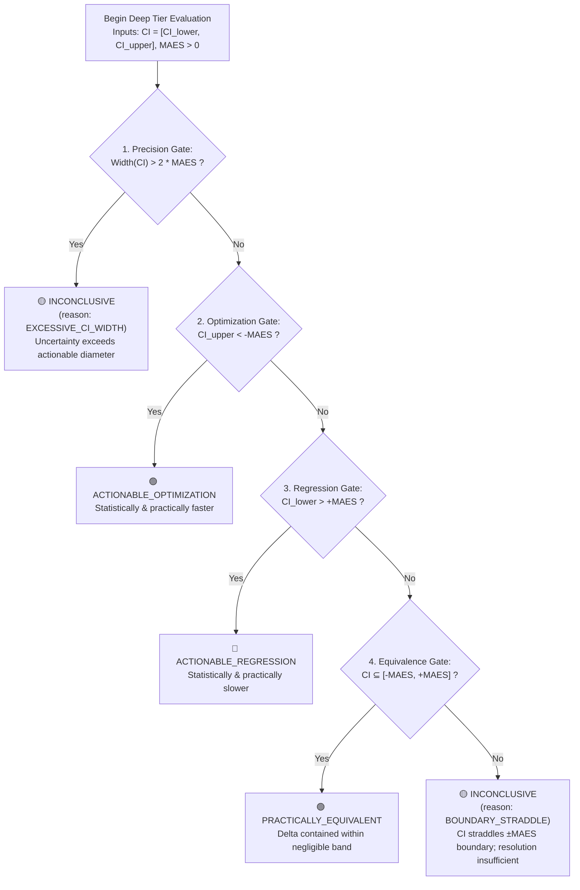

# Cadence Bench: Adaptive Two-Tier Benchmarking & Capacity Profiler

In experimental GPU/CPU computing, physics simulation, and graphics software, conventional timing benchmarks (e.g. taking the median of 5 runs on a single input with a rigid 5% threshold) are scientifically invalid. They conflate hardware thermal drift with code regressions, fail to detect asymptotic scaling cliffs, and collapse when an algorithm encounters an Out-Of-Memory (OOM) ceiling.

Cadence Bench implements **Adaptive Two-Tier Benchmarking**, executed authoritatively via [`scripts/bench_engine.py`](scripts/bench_engine.py):
1. **Fast Tier (Daily TDD):** Cheap, non-asymptotic gross-change detector ($< 3.0\text{s}$) executing on nominal workloads to catch catastrophic regressions during everyday development.
2. **Deep Tier (Milestone / Pre-Merge):** Full adaptive statistical profiling suite evaluating contract-declared workload sweeps, moving-block bootstrapped confidence intervals against the Minimum Actionable Effect Size ($\pm\text{MAES}$), and isolated capacity envelope limits.

---

## 1. Linguistic Disambiguation & Epistemological Scope

> **Linguistic Rule:**  
> In Cadence, **Tier 1** and **Tier 2** refer *strictly and exclusively* to **Two-Tier Governance (Pillar 1)**.  
> Benchmarking is *strictly and exclusively* referred to as **Fast Tier** and **Deep Tier** to eliminate any semantic collision or cross-domain ambiguity.

> **Epistemological Principle:**  
> Cadence does **not** claim to automatically guarantee scientific validity. Cadence provides **controlled measurement execution, empirical uncertainty analysis, capacity envelope detection, and reproducible evidence**. The human-authored benchmark contract remains responsible for exercising the intended engineering questions.

---

## 2. Fast Tier Architecture: Gross-Change Detection (Daily TDD)

- **Execution Context:** Invoked during continuous `/cad-flow` TDD loops via `python scripts/bench_engine.py fast`.
- **Execution Budget:** Strict wall-clock cutoff $\le 3.0$ seconds on nominal workload ($N_{\text{nominal}}$). If execution exceeds $3.0\text{s}$, a budget overrun warning is recorded.
- **Measurement Method:** Evaluates rapid iterations of nominal workload, recording minimum timing and distribution.
- **Authorized Detection Semantics:**
  $$\text{relative\_change} = \frac{T_{\min, \text{cand}} - T_{\min, \text{base}}}{T_{\min, \text{base}}}, \quad \text{gross\_change} = |\text{relative\_change}| > 0.25$$
  - **Exact Boundary Semantics:**
    - $|\text{relative\_change}| \le 0.25000 \implies$ **`NO_GROSS_CHANGE_DETECTED`**
    - $|\text{relative\_change}| > 0.25000 \implies$ **`GROSS_CHANGE_DETECTED`**
- **Directional Reporting:** Direction is reported separately (`REGRESSION`, `SPEEDUP`, or `NEUTRAL`) rather than conflated with the magnitude threshold.
- **Rule of Non-Equivalence & Non-Certification:** The Fast Tier outcome is *never* represented as equivalent to the Deep Tier's statistical conclusions. Fast Tier does not certify optimization, regression, equivalence, or asymptotic scaling.
- **Deep Tier Invocation Policy:**
  - By default, Fast Tier alerts the engineer and recommends running Deep Tier: `Recommendation: Run /cad-bench --deep to statistically profile this gross change.`
  - If `--auto-deep` is explicitly passed, the command automatically triggers the Deep Tier evaluation pipeline.
- **Mandatory Disclaimer:** Fast Tier outputs always include:
  ```text
  ⚠️ [FAST-TIER NOTICE] Measures local execution under current nominal workload; does NOT validate asymptotic scaling or certify optimization, regression, or equivalence.
  ```

---

## 3. Deep Tier Architecture: Adaptive Statistical Profiling Matrix

Invoked via `/cad-bench --deep` or milestone gates.

### 3.1 Workload Sweeps & Metric Pluralism
- **Workload Sweep:** Evaluates across contract-declared parameter sweeps ($N_1, \dots, N_m$), not arbitrary scales.
- **Supported Governing Metrics:** `min`, `median`, `p95`, `p99`, `iqr`.
- **Quantile Estimator Convention:** All quantiles ($P_{95}, P_{99}, Q_1, Q_3$) and $\text{IQR} = Q_3 - Q_1$ are computed strictly using **Hyndman & Fan (1996) Type 7** continuous linear interpolation ($k = (n - 1) \times p, \gamma = k - \lfloor k \rfloor$), matching NumPy's default (`method='linear'`), SciPy, and R Type 7.
- **Governing Metric Control:** The benchmark contract declares which metric gates the outcome. The statistical bootstrap resamples and computes deltas on the **declared governing metric**.
- **No Silent Substitution:** Rejects undeclared or invalid metrics with explicit validation errors. Median is never substituted silently for tail metrics (`p95`, `p99`).

### 3.2 Moving-Block Bootstrap & Adaptive Precision Formulation
To account for short-range serial autocorrelation, thread scheduling jitter, and GPU thermal drift:
- Resamples blocks of size $B = \max(3, \lfloor \sqrt[3]{K} \rfloor)$ consecutive runs to generate the **95% Confidence Interval of Difference**:
  $$\Delta_{\text{metric}} = M_{\text{candidate}} - M_{\text{baseline}} \implies \text{CI} = [\text{CI}_{\text{lower}}, \text{CI}_{\text{upper}}], \quad \text{CI}_{\text{width}} = \text{CI}_{\text{upper}} - \text{CI}_{\text{lower}}$$
- **Authorized Adaptive Precision Criteria (Decision A1):**
  - **Normal Precision Criterion ($|\Delta| > \text{MAES}$):**
    $$\text{RCIW} = \frac{\text{CI}_{\text{width}}}{|\Delta_{\text{metric}}|}$$
  - **Near-Zero Precision Criterion ($|\Delta| \le \text{MAES}$):**
    $$\text{RCIW}_{\text{MAES}} = \frac{\text{CI}_{\text{width}} / 2}{\text{MAES}}$$
- **Adaptive Stopping Rule:**
  Stop sampling when the applicable precision criterion satisfies $\text{Criterion} \le \text{RCIW}_{\text{target}}$ (e.g. 10%), subject to $K_{\min} \le K \le K_{\max}$ (and execution budget $10\text{s} \le T \le 45\text{s}$).
  - When target precision is met: terminates with `stopping_reason: "TARGET_RCIW_MET"`.
  - When budget or $K_{\max}$ is exhausted: terminates with `stopping_reason: "BUDGET_OR_K_MAX_EXHAUSTED"`.
- **Final Verdict Invariant:** Final verdict always uses the canonical 5-step MAES precedence ladder. No tolerance or MAES relaxation is permitted autonomously.
  - Else: continues sampling next iteration ($K \leftarrow K + 1$).

### 3.4 The 5-Step Mutually Exclusive Precedence Ladder vs. MAES
The outcome is determined by comparing $\text{CI} = [\text{CI}_{\text{lower}}, \text{CI}_{\text{upper}}]$ and $\text{Width}(\text{CI}) = \text{CI}_{\text{upper}} - \text{CI}_{\text{lower}}$ against the declared Minimum Actionable Effect Size ($\text{MAES} > 0$):



| Step / Precedence | Condition | Assigned Outcome | Formal Engineering Rationale |
|:---:|:---|:---|:---|
| **1. Precision Gate** | $\text{Width}(\text{CI}) > 2 \times \text{MAES}$ | **`INCONCLUSIVE`**<br>`(reason: EXCESSIVE_CI_WIDTH)` | Measurement variance exceeds the actionable diameter. Resolution is too coarse to distinguish effects. |
| **2. Optimization Gate** | $\text{CI}_{\text{upper}} < -\text{MAES}$ | **`ACTIONABLE_OPTIMIZATION`** | With $\ge 95\%$ confidence, candidate is faster than baseline by more than the actionable threshold. |
| **3. Regression Gate** | $\text{CI}_{\text{lower}} > +\text{MAES}$ | **`ACTIONABLE_REGRESSION`** | With $\ge 95\%$ confidence, candidate is slower than baseline by more than the actionable threshold. |
| **4. Equivalence Gate** | $[\text{CI}_{\text{lower}}, \text{CI}_{\text{upper}}] \subseteq [-\text{MAES}, +\text{MAES}]$ | **`PRACTICALLY_EQUIVALENT`** | With $\ge 95\%$ confidence, any delta is strictly contained within the non-actionable tolerance band. |
| **5. Boundary Straddle** | *Default Fallthrough*<br>($\text{Width}(\text{CI}) \le 2 \times \text{MAES}$ and CI overlaps $-\text{MAES}$ or $+\text{MAES}$) | **`INCONCLUSIVE`**<br>`(reason: BOUNDARY_STRADDLE)` | Interval straddles an actionable threshold. Resolution is insufficient to decide if the true effect exceeds MAES. |

---

## 4. Deterministic Warmup Procedure & Empirical Stability Heuristic

### Procedure:
- Sliding window of size $W=3$ warmup iterations.
- Stability heuristic is satisfied when:
  $$\text{Window Drift} = \frac{\max(W) - \min(W)}{\text{Median}(W)} \le 5\%$$
- Normal budget: $W_{\min} = 3$, $W_{\max} = 15$.

### Deterministic Fallback Procedure on Non-Stationary Warmup:
If warmup drift does not satisfy the stability heuristic within budget:
1. **Emit Structured Warning:** Emit `WARMUP_NON_STATIONARY` with observed drift ratio $\delta_{\text{obs}}$.
2. **Deterministic Block Size Inflation:**
   Standard block size $B_{\text{default}} = \max(3, \lfloor \sqrt[3]{K_{\min}} \rfloor)$ is deterministically inflated to:
   $$B_{\text{fallback}} = \min\left(2 \times B_{\text{default}}, \left\lfloor \frac{K_{\min}}{2} \right\rfloor\right)$$
3. **Deterministic Sampling Budget Expansion:**
   Minimum sample size $K_{\min}$ is deterministically expanded:
   $$K_{\min, \text{fallback}} = \min\left(K_{\max}, \max(15, K_{\min} + 5)\right)$$
4. **Strict Sample Segregation:** Warmup samples are strictly segregated and discarded; zero contaminated warmup data enters the measurement distribution.
5. **Telemetry Tagging:** Output report records `"stationarity_heuristic": "FAILED"`, `drift_ratio`, and `fallback_applied: true`.

---

## 5. Capacity Envelope Isolation Architecture & Windows-Native Supervision

Workload sweeps push hardware to physical memory and execution bounds. To ensure benchmark stability:

1. **Process-Isolated Execution Worker:**
   Every workload point $(N_i)$ executes in an isolated worker subprocess.
2. **Authoritative Windows-Native Tree Termination:**
   - Worker processes are supervised using monotonic timers.
   - If execution exceeds $T_{\text{watchdog}}$, the controller executes the authoritative Windows-native command:
     ```powershell
     taskkill.exe /F /T /PID $workerPid
     ```
     This terminates the worker, child helper processes, compiler threads, and grandchildren without leaving orphaned processes.
3. **Four Distinct Capacity Envelope Outcomes:**
   The controller traps worker exits and classifies four distinct capacity limits:
   - **`CAPACITY_LIMIT_TIMEOUT`:** Watchdog monotonic cutoff exceeded; worker tree terminated via `taskkill.exe`.
   - **`CAPACITY_LIMIT_OOM`:** Host OS RAM exhaustion (`MemoryError` / `STATUS_NO_MEMORY` `0xC0000017`) or GPU VRAM allocation failure (`torch.cuda.OutOfMemoryError`).
   - **`CAPACITY_LIMIT_DEVICE_LOST`:** GPU hardware or driver TDR crash: Windows `0x887A0006` (`DXGI_ERROR_DEVICE_HUNG`), `0x887A0005` (`DXGI_ERROR_DEVICE_REMOVED`), or Vulkan `VK_ERROR_DEVICE_LOST` (`-4`).
   - **`CAPACITY_LIMIT_WORKER_CRASH`:** Unhandled native access violation (`STATUS_ACCESS_VIOLATION` `0xC0000005`, segmentation fault, or uncaught native assertion).
4. **Capacity Isolation from Latency Statistics:**
   - Points encountering capacity limits are **completely excluded** from latency distributions, moving-block bootstrap, and latency summary statistics.
   - The capacity limit is anchored at $N_{\max} = N_{i-1}$, and the failure is preserved strictly within the `capacity_envelope` section.

---

## 6. Output Report & Machine-Readable Schema

Outputs conform to [`schemas/benchmark-report-v1.json`](../../schemas/benchmark-report-v1.json):

```markdown
# ⚡ Cadence Deep Benchmark Report: [Kernel Name]

## Executive Summary
- **Verdict:** 🟢 `ACTIONABLE_OPTIMIZATION` (Speedup > MAES)
- **Governing Metric:** Median Latency (Contract: `contracts/solver.yaml`)
- **95% Bootstrap CI of Delta:** `[-14.2 ms, -8.6 ms]` (vs MAES = `±5.0 ms`)
- **Capacity Envelope:** $N_{\max} = 10^6$ particles (Clean completion)

## Performance & Scaling Sweep
| Workload N | Baseline Median | Candidate Median | Delta (95% CI) | Status |
|---|---|---|---|---|
| $10^3$ | 0.82 ms | 0.51 ms | [-0.34 ms, -0.28 ms] | 🟢 Optimal |
| $10^4$ | 7.40 ms | 4.10 ms | [-3.50 ms, -3.10 ms] | 🟢 Optimal |
| $10^5$ | 78.2 ms | 42.1 ms | [-38.1 ms, -34.0 ms] | 🟢 Optimal |
| $10^6$ | 840.5 ms | 460.2 ms | [-395.0 ms, -365.0 ms] | 🟢 Optimal |
| $10^7$ | OOM | OOM | - | ⚠️ `CAPACITY_LIMIT_OOM` ($N_{\max} = 10^6$) |
```
