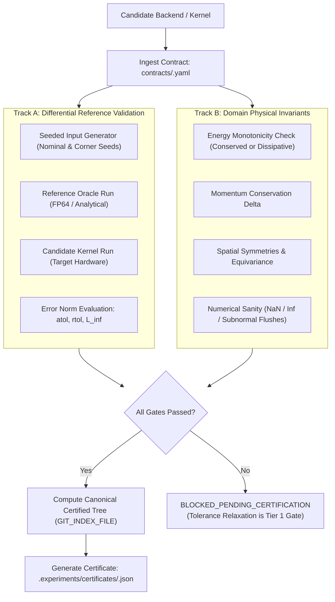

# Cadence Oracle: Layered Numerical & Physical Validation Engine

In accelerated computing (CUDA, Vulkan, Metal, ROCm, WebGPU) and numerical simulation, standard unit tests (e.g. `assert output is not None`) are insufficient to detect floating-point divergence, race conditions, accumulation drift, or loss of physical conservation laws.

Cadence Oracle executes **Layered Synthesized Validation** combining:
1. **Track A (Differential Testing):** Evaluates candidate accelerated kernel against a Golden Reference Oracle (CPU analytical or double-precision baseline) across seeded inputs, checking `atol`, `rtol`, and $L_\infty$ norms.
2. **Track B (Domain Physical Invariants):** Asserts problem-specific mathematical invariants (energy conservation or monotonic dissipation, momentum conservation, spatial symmetries, and zero NaNs/infs).
3. **Non-Circular Canonical Tree Identity:** Computes and verifies the exact candidate content tree via isolated temporary Git index plumbing (`GIT_INDEX_FILE`), issuing a cryptographically bound certificate in `.experiments/certificates/<tree_sha>.json`.

---

## 1. The Dual-Track Validation Protocol



### Track A: Differential Testing
- Compares candidate outputs $Y_{\text{cand}}$ against reference outputs $Y_{\text{ref}}$ across a deterministic seed matrix:
  $$|Y_{\text{cand}} - Y_{\text{ref}}| \le \text{atol} + \text{rtol} \times |Y_{\text{ref}}|$$
  $$L_\infty = \max |Y_{\text{cand}} - Y_{\text{ref}}| \le L_{\infty, \max}$$
- Evaluates corner cases: denormals, high-aspect-ratio geometries, zero-velocity states, high-stiffness limits.

### Track B: Domain-Declared Physical Invariants
Evaluates trajectory invariants declared in `contracts/<module>.yaml`:
- **Energy Behavior:**
  - `CONSERVED`: $|E(t) - E(0)| / E(0) \le \epsilon_{\text{energy}}$
  - `MONOTONIC_DISSIPATIVE`: $E(t_{k+1}) \le E(t_k) + \epsilon_{\text{drift}}$ (no unphysical energy generation)
  - `UNCONSTRAINED`: For open/driven systems
- **Momentum Conservation:** Linear and angular momentum drift $\Delta P \le \epsilon_{\text{momentum}}$
- **Spatial Symmetries:** Invariance under translations and rotational equivariance where applicable
- **Numerical Sanity:** Zero NaNs, zero infinities, and zero unexpected subnormal flushes across all integration steps

---

## 2. Canonical Certified Content Tree Plumbing (`GIT_INDEX_FILE`)

### Problem Solved: Self-Inclusion Immunity & Candidate Snapshotting
A validation certificate is stored inside `.experiments/certificates/<tree_sha>.json`. If a naive git tree hash was used, adding or committing the certificate would mutate the tree hash, creating a circular invalidation loop. Furthermore, reading `HEAD` would certify past commits rather than the candidate code on disk.

Cadence Oracle resolves this by using an isolated temporary Git index to compute the **Canonical Certified Content Tree**:

```powershell
function Get-Canonical-Candidate-Tree {
    param(
        [string]$RepoRoot = (git rev-parse --show-toplevel),
        [string[]]$Exclusions = @(".experiments/certificates/**", ".experiments/traces/**")
    )
    
    $rawGitDir = (git -C $RepoRoot rev-parse --git-dir).Trim()
    $gitDir = if ([System.IO.Path]::IsPathRooted($rawGitDir)) { $rawGitDir } else { Join-Path $RepoRoot $rawGitDir }
    $primaryIndex = Join-Path $gitDir "index"
    $tempIndex = Join-Path $gitDir "cadence_cand_index_$([Guid]::NewGuid().ToString('N'))"
    $origIndexEnv = $env:GIT_INDEX_FILE
    
    try {
        # 1. Snapshot primary index baseline
        if (Test-Path $primaryIndex) {
            Copy-Item $primaryIndex $tempIndex
        } else {
            New-Item -ItemType File -Path $tempIndex | Out-Null
        }
        
        # 2. Redirect Git plumbing to isolated temporary index
        $env:GIT_INDEX_FILE = $tempIndex
        
        # 3. Synchronize candidate working-tree state into temp index:
        #    - Tracked modifications: updated
        #    - New files: added (honoring .gitignore)
        #    - Deletions: removed
        #    - Unified staged & unstaged candidate changes
        git -C $RepoRoot add -A
        
        # 4. Explicitly unstage and purge excluded certificate and trace paths
        foreach ($pattern in $Exclusions) {
            git -C $RepoRoot rm --cached -r -q --ignore-unmatch $pattern 2>$null
        }
        
        # 5. Write the canonical content tree object
        $canonicalTreeSha = git -C $RepoRoot write-tree
        return $canonicalTreeSha
    }
    finally {
        # 6. Restore original environment and delete temporary index
        $env:GIT_INDEX_FILE = $origIndexEnv
        if (Test-Path $tempIndex) { Remove-Item -Force $tempIndex }
    }
}
```

---

## 3. Pre-Commit Verification Plumbing (`Verify-Canonical-Staged-Tree`)

When changes are staged and `git commit` or `cadence-review` executes, verification asserts that the staged state matches the certificate using the **exact same exclusion pathspecs** recorded in the certificate:

```powershell
function Verify-Canonical-Staged-Tree {
    param(
        [string]$RepoRoot = (git rev-parse --show-toplevel),
        [string]$CertificatePath
    )
    $cert = Get-Content $CertificatePath -Raw | ConvertFrom-Json
    $rawGitDir = (git -C $RepoRoot rev-parse --git-dir).Trim()
    $gitDir = if ([System.IO.Path]::IsPathRooted($rawGitDir)) { $rawGitDir } else { Join-Path $RepoRoot $rawGitDir }
    $primaryIndex = Join-Path $gitDir "index"
    $tempIndex = Join-Path $gitDir "cadence_verify_index_$([Guid]::NewGuid().ToString('N'))"
    $origIndexEnv = $env:GIT_INDEX_FILE
    
    try {
        # 1. Snapshot primary staged index
        Copy-Item $primaryIndex $tempIndex
        $env:GIT_INDEX_FILE = $tempIndex
        
        # 2. Filter using the EXACT SAME exclusion pathspecs recorded in the certificate
        foreach ($pattern in $cert.exclusion_pathspecs) {
            git -C $RepoRoot rm --cached -r -q --ignore-unmatch $pattern 2>$null
        }
        
        # 3. Write the filtered staged tree
        $stagedCanonicalTreeSha = git -C $RepoRoot write-tree
        
        # 4. Assert exact equality
        if ($stagedCanonicalTreeSha -ne $cert.canonical_tree_sha) {
            throw "ERR_TREE_MUTATED_POST_CERTIFICATION: Staged content tree ($stagedCanonicalTreeSha) does not match certified tree ($($cert.canonical_tree_sha)). Re-run /cad-oracle before committing."
        }
        return $true
    }
    finally {
        $env:GIT_INDEX_FILE = $origIndexEnv
        if (Test-Path $tempIndex) { Remove-Item -Force $tempIndex }
    }
}
```

---

## 4. Protected Tolerance Governance Gate (Anti-Loosening Hook)

> **Rule:** *Tolerance relaxation is strictly a Tier 1 decision.*  
> If candidate kernel outputs exceed `atol`, `rtol`, $L_\infty$, or invariant bounds:
> - The agent is **strictly prohibited from loosening tolerances autonomously** in `contracts/*.yaml` or test fixtures to make the test pass.
> - Modifying tolerances in a relaxing direction is an automatic **Tier 1 Foundational Decision (Vector 3: Precision or Error Tolerances)**.
> - Cadence Oracle halts execution, generates an Evidence Dossier showing the error distributions and seed discrepancies, and requires explicit human approval via `ask_question`.

---

## 5. Certificate Storage & Schema

Certificates are saved as physical JSON files in `.experiments/certificates/<canonical_tree_sha>.json` conforming to [`schemas/validation-certificate-v1.json`](../../schemas/validation-certificate-v1.json):

```json
{
  "$schema": "https://cadence.dev/schemas/validation-certificate-v1.json",
  "certificate_id": "8c78649a93a5afff375eaaac07049b56cb5081c4.json",
  "timestamp": "2026-09-26T00:25:00Z",
  "tree_spec_version": "v1",
  "canonical_tree_sha": "8c78649a93a5afff375eaaac07049b56cb5081c4",
  "inclusion_rules": ["TRACKED_AND_UNIGNORED_WORKING_TREE"],
  "exclusion_pathspecs": [".experiments/certificates/**", ".experiments/traces/**"],
  "contract_file": "contracts/jacobi_solver.yaml",
  "contract_sha256": "4b92f8a183d71e21b759685934524c53835f86b4...",
  "target_backend": { "backend": "CUDA", "device_name": "NVIDIA RTX 4090", "precision": "FP32" },
  "reference_backend": { "backend": "CPU", "device_name": "Host CPU", "precision": "FP64" },
  "track_a_differential": {
    "status": "PASSED",
    "evaluated_seeds": [42, 100, 2026],
    "max_abs_error": 0.00014,
    "max_rel_error": 0.00008,
    "l_inf_norm": 0.00031,
    "tolerances": { "atol": 0.001, "rtol": 0.001, "l_inf_max": 0.005 }
  },
  "track_b_domain_invariants": {
    "status": "PASSED",
    "energy_monotonicity": { "verdict": "PASSED", "mode": "MONOTONIC_DISSIPATIVE", "max_violation": 0.0 },
    "momentum_conservation": { "verdict": "PASSED", "max_delta": 0.00002 },
    "symmetry_equivariance": { "verdict": "PASSED" },
    "nan_inf_free": { "verdict": "PASSED", "nan_count": 0, "inf_count": 0 }
  },
  "verdict": "PASSED"
}
```

---

## 6. CLI Command Integration

Execute Cadence Oracle via:
```text
/cad-oracle [contract_path]
```
If `contract_path` is omitted, Oracle automatically discovers active contracts in `contracts/*.yaml`.
